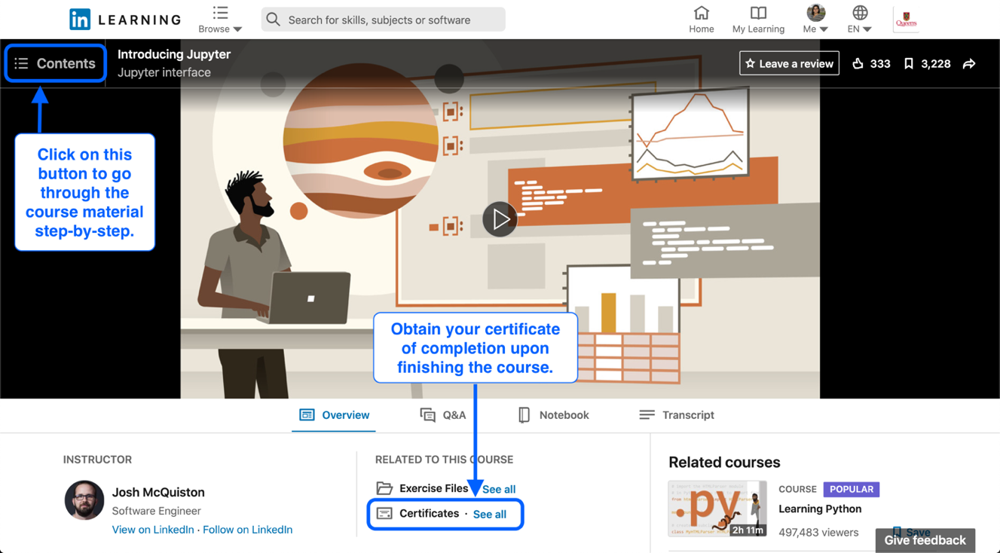

# Jupyter

Go through the content of the LinkedIn Learning [Introducing Jupyter](https://www.linkedin.com/learning/introducing-jupyter/) course step-by-step and take the time to practice the material covered in your Jupyter notebook. Upon completing this course, you can upload your certificate of completion to show you have completed this assignment, as shown below.

