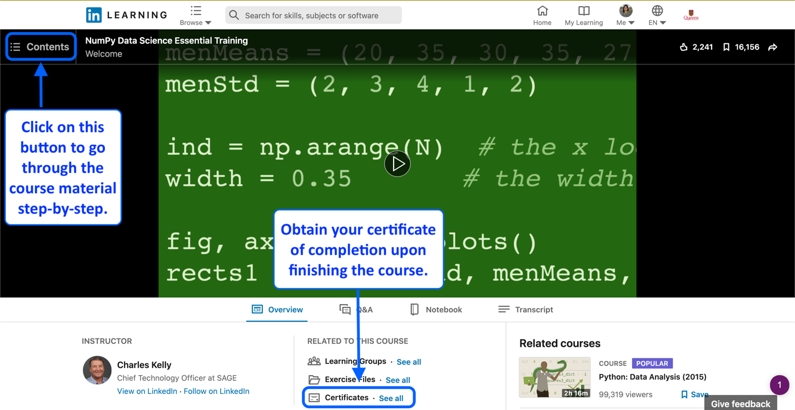

# Numpy

Numpy is the most important external library we will use in this course, and it is important to become very comfortable with it. To start, please go through:

- [Numpy Introduction from W3Schools](https://www.w3schools.com/python/numpy_intro.asp). This interactive tutorial introduces you to the Numpy library and, helpfully, you can run the examples directly in the browser.
- Watch the following short LinkedIn Learning videos. These
  - give you an [overview of Numpy](https://www.linkedin.com/learning/python-data-analysis-2015/numpy-overview).
  - explain [how to create Numpy arrays](<https://www.linkedin.com/learning/python-data-analysis-2015/creating-numpy-arrays>)
  - teach you [how to do mathematical operations with and on arrays](https://www.linkedin.com/learning/python-data-analysis-2015/doing-math-with-arrays)
  - show how to [index and slice arrays into pieces](https://www.linkedin.com/learning/python-data-analysis-2015/indexing-and-slicing)
- Numpy's official website provides a valuable additional resource, [Numpy: The absolute basics for beginners](https://numpy.org/devdocs/user/absolute_beginners.html)

Once you have a basic familiarity with Numpy, you can complete the LinkedIn Learning [Numpy Data Science Essential Training](https://www.linkedin.com/learning/numpy-data-science-essential-training/) and submit your certificate, as shown below, to complete this assignment.

- As you work through the course, please have a Jupyter notebook open and try the presented code snippets yourself.
- You may skip the "Numpy, data science, IMQAV" under the "Introduction" section.
- You may skip "Install Software" under the "Introduction" section.
- You may skip "7. Extended Examples"; while these are good Numpy practice cases, they are less relevant to us.

